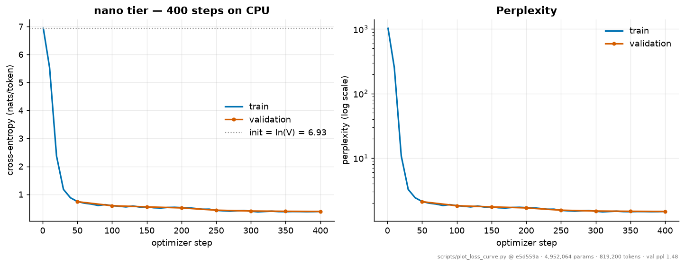

<div align="center">

# NanoScale-LM

**I built a language model from scratch and then made it deployable on hardware anyone can afford.**

[](https://github.com/vedant1711/nanoscale-lm/actions/workflows/ci.yml)
[](https://vedant1711.github.io/nanoscale-lm/)
[](pyproject.toml)
[](pyproject.toml)
[](pyproject.toml)
[](tests/)
[](LICENSE)

### ▶ &nbsp;[**Try the live demo**](https://vedant1711.github.io/nanoscale-lm/demo.html) &nbsp;·&nbsp; 📖 &nbsp;[**Read the documentation**](https://vedant1711.github.io/nanoscale-lm/explainer.html)

The demo runs in any browser with no install: generate text, step through the model's
next-token distribution, watch it compress text losslessly and flag anomalies. The
documentation is the whole project on one page — every algorithm, diagram, design decision
and measurement, written for anyone who knows Transformers and nothing past them.

[Results](https://vedant1711.github.io/nanoscale-lm/results/) ·
[Notebooks](notebooks/) ·
[Weights](artifacts/models/)

</div>

---

A fully-typed PyTorch implementation of a modern small decoder-only language model **and**
the complete efficiency stack needed to serve it — distillation, quantization and
speculative decoding — in one project that runs end to end on free hardware.

Every core algorithm is written out in this repository: the BPE merges, attention with
GQA/RoPE/QK-norm, Muon's Newton–Schulz orthogonalization, the DPO and SimPO losses,
GPTQ's Hessian error compensation, the speculative accept/reject rule. No high-level
trainer library appears anywhere in `src/nanoscale/`.

```bash
git clone https://github.com/vedant1711/nanoscale-lm && cd nanoscale-lm
make install
make smoke     # tokenizer -> pretrain -> SFT -> DPO -> quantize -> speculate, 45s on CPU
```

## Architecture

```
                                   tokens
                                      │
                        ┌─────────────▼──────────────┐
                        │ byte-level BPE, 1024 vocab │   761 merges, exact byte round-trip
                        └─────────────┬──────────────┘
                                      │
                               token embedding
                                      │
   ┌──────────────────────────────────▼───────────────────────────────┐
   │  × N transformer blocks  (pre-norm residual)                     │
   │                                                                  │
   │     ┌──► RMSNorm ──► CausalSelfAttention ──┐                     │
   │     │                 · GQA  (n_kv < n_q)  │                     │
   │     x                 · RoPE (paired)     (+)──► x               │
   │     │                 · QK-norm pre-RoPE   │                     │
   │     └─────────────────· KV cache ──────────┘                     │
   │                                                                  │
   │     ┌──► RMSNorm ──► SwiGLU MLP ───────────┐                     │
   │     x                                     (+)──► x               │
   │     └──────────────────────────────────────┘                     │
   └──────────────────────────────────┬───────────────────────────────┘
                                      │
                         RMSNorm ──► untied LM head
                                      │   ├─ optional tanh logit soft-cap
                                      │   └─ optional multi-token-prediction heads
                                      ▼
                                   logits
```

| Stage | What runs |
|---|---|
| **Training** | Muon (Newton–Schulz) on 2-D hidden matrices · AdamW on embeddings, head and norms · cosine or WSD schedule · gradient accumulation · AMP with fp32 master weights |
| **Alignment** | SFT (completion-masked) → DPO / SimPO → optional GRPO-RLVR |
| **Serving** | distillation (17.7× smaller) · GPTQ 4-bit (4.3× smaller weights) · speculative decoding (3× fewer target passes, distribution unchanged) |

## The result



**4,952,064 parameters. 819,200 tokens. 95 seconds on a laptop CPU.** Validation loss
0.3896 (perplexity 1.4764), starting from exactly `ln(1024) = 6.9315` — which is what the
zero-init residual scheme predicts, and is checked rather than asserted.

Sampled from the committed checkpoint (`results/samples/nano_base.md`):

> It was a sunny day. Lily went to the park with a patient hedgehog. Lily wanted to find
> a torn map. But a torn map was too heavy to lift. She tied her scarf around it for
> grip. A patient hedgehog pushed from the other side. She sat down and thought about the
> problem. With one more try a torn map came loose.

`nano` trains on a synthetic story corpus ([`src/nanoscale/data/toy.py`](src/nanoscale/data/toy.py)),
so this shows the pipeline learns structure — agreement, coreference, narrative shape — not
that it models open-domain text. The `micro` tier trains on FineWeb-Edu to a full 20:1
token budget for that.

## What is here

**Arc 1 — build the model.**

| | Implemented from scratch |
|---|---|
| **Tokenizer** | Byte-level BPE with incremental pair counting and an inverted index; GPT-2/GPT-4 pre-tokenization regexes; chat template; exact byte round-trip with no `<unk>` |
| **Model** | Decoder-only transformer — GQA, RoPE, QK-norm, RMSNorm, SwiGLU/ReLU², KV cache, zero-init output projections, optional logit soft-cap and multi-token-prediction heads |
| **Optimizer** | AdamW *and* Muon (Newton–Schulz quintic orthogonalization), with a parameter router, cautious weight decay, and both verified against closed-form solutions |
| **Training** | Packing, deterministic seeded batching, cosine/WSD schedules, gradient accumulation, AMP with fp32 master weights, bit-exact resumable checkpoints |
| **Alignment** | Completion-masked SFT, DPO (+ cDPO smoothing, + RPO-style NLL anchor), SimPO, and a GRPO-RLVR track with the k3 KL estimator |

**Arc 2 — make it cheap to serve.**

| | Implemented from scratch |
|---|---|
| **Distillation** | Forward KL with the τ² correction, SeqKD, and MiniLLM-style on-policy reverse KL with reward-to-go and a single-step regularizer |
| **Quantization** | RTN, GPTQ (Cholesky Hessian error compensation, lazy block updates, activation ordering), AWQ scale search, KV-cache quantization, effective-bit accounting |
| **Speculative decoding** | The modified rejection rule with residual resampling, plus Medusa heads with tree attention and depth-derived position IDs |
| **Serving** | Streaming generation with incremental UTF-8 decoding, stop sequences, prefill/decode timing breakdown, and a Gradio demo |

## Headline measurements

Every number below is produced by a committed script, stamped with the git SHA and
hardware that produced it, and regenerable in replay mode. Full tables and caveats in
**[docs/results.md](docs/results.md)**.

| Claim | Measurement | Script |
|---|---|---|
| Beats GPT-2 on in-domain bits/byte | **0.5485 vs 0.9385** with 3.1× fewer params — reverses out of domain | `scripts/external_baseline.py` |
| Muon converges faster than AdamW | **53 vs 106** steps to target, p < 0.0001 over 5 seeds | `scripts/ablate_multiseed.py` |
| Muon is far more stable across seeds | **176× lower variance** (F = 176.4, p = 0.0002) | `scripts/ablate_multiseed.py` |
| The model has *not* learned agreement | 94% simple vs **44%** with an attractor — linear recency | `scripts/evaluate.py` |
| Distillation shrinks the model 17.7× | 4,952,064 → 279,168 params; reverse-KL student ppl 2.497 with repetition **0.0000** (teacher: 0.0383) | `scripts/distill_compare.py` |
| GPTQ beats RTN where it matters | 2-bit ppl **1.4997 vs 1.5405**; a tie at 4 bits, reported as a tie | `scripts/quantize_frontier.py` |
| Speculation cuts target forward passes 3× | **2.94** tokens per target pass at γ=6, output distribution provably unchanged | `scripts/specdec_bench.py` |
| DPO needs its NLL anchor here | DPO alone: **0-7-33** vs SFT. DPO+NLL: **3-0-37** | `scripts/align_pipeline.py` |
| The whole pipeline runs on a CPU | tokenizer→pretrain→SFT→DPO→quantize→speculate in **45 s** | `tests/e2e/test_smoke.py` |

## Results that did not go the way the plan said

These are in the docs for the same reason the ones above are — leaving them out would
make the positive results untrustworthy.

- **QK-norm, zero-init and SwiGLU show no measurable difference in final loss** at this
  scale. All three land within 1.4% of the default, below the 2% threshold this project
  is willing to call a result from a single seed. QK-norm does reach the target in 1.5×
  fewer steps, so they converge to the same place at different rates.
- **GPTQ does not beat RTN at 4 bits.** The spec predicted a clear margin. There is no
  margin left to win — a 5M-parameter model on a narrow corpus has little redundancy for
  4-bit rounding to destroy.
- **Speculative decoding is slower in wall-clock here** (0.79× at γ=6) even while cutting
  target passes 3×. Speculation trades compute for memory bandwidth, and at 5M parameters
  on a CPU a forward pass is bound by Python dispatch, not by weight loading.
- **Muon loses to AdamW on a convex single-matrix least-squares problem.** That is where
  Adam is near-optimal; the win shows up on deep, badly-conditioned nets. Both outcomes
  are pinned as tests.
- **A hypothesis about GPTQ was wrong.** Error compensation helps even with white
  activations, so the "advantage comes from the Hessian" test was false as written and
  was split into two narrower true claims.

## The size ladder

One architecture; only depth, width, context and token budget change. Token budgets
follow the Chinchilla-style 20:1 heuristic.

| Tier | Params (total / non-emb.) | Layers × d_model × heads | Context | Token budget | Trains on |
|---|---|---|---|---|---|
| `nano` | 4,952,064 / 4,427,776 | 6 × 256 × 4 | 256 | 0.8M (step-driven) | Laptop CPU, 95 s |
| `micro` | 40,379,904 / 23,602,688 | 8 × 512 × 8 | 512 | 808M (20:1) | Free Colab T4 |
| `small` | 125,849,856 / 75,518,208 | 12 × 768 × 12 | 1024 | 2.52B (20:1) | Scale-up recipe |

These counts are asserted as exact constants against both the analytic formula and the
built `nn.Module`, so architecture drift fails loudly. `nano` is deliberately *not*
compute-optimal — 20:1 on 5M parameters is ~99M tokens, which is hours of CPU. It exists
to be a sub-10-minute teaching and CI tier, and its manifests record what fraction of the
compute-optimal budget it actually covered.

## Reproducibility

Reproducibility here is a feature with tests, not a paragraph in a README.

- **Every run writes a manifest** — git SHA, dirty flag, config hash, seed, hardware,
  library versions, wall clock, and the metrics it produced.
- **Every figure and table is regenerable** without retraining: `--replay` re-renders from
  the committed JSON.
- **`docs/results.md` is generated** from the files under `results/` by
  `scripts/build_docs_results.py`, and CI fails if the committed page has drifted. No
  number exists in two places.
- **Error bars are reported** where they are meaningful — perplexity intervals follow
  Miller ([arXiv:2411.00640](https://arxiv.org/abs/2411.00640)), accuracy uses a binomial
  standard error, and differences below the stated noise threshold are called *no
  measurable difference*.
- **Determinism is tested**: same seed → identical loss curve; save → load → resume is
  bit-exact and continues from the exact batch offset, which is a bug this project had
  and fixed.

## Try it

| | |
|---|---|
| **Train from scratch** | [`notebooks/colab_train_from_scratch.ipynb`](notebooks/colab_train_from_scratch.ipynb) — tokenizer, model, optimizer, pretraining. CPU path ~2 min; GPU path trains `micro` on FineWeb-Edu. |
| **Compress and serve** | [`notebooks/colab_compress_and_serve.ipynb`](notebooks/colab_compress_and_serve.ipynb) — distillation, GPTQ, speculative decoding, with the losslessness proof run live. |
| **Interactive demo** | [`demo/app.py`](demo/app.py) — Gradio app: generate, compare variants, inspect the tokenizer, watch speculation accept and reject. |

### Checkpoints

The `nano` models are committed under [`artifacts/models/`](artifacts/models/) — base, SFT,
aligned, and the 279k-parameter distilled draft, stripped to weights plus their embedded
config by `scripts/export_models.py`. That is 58 MB, small enough to live in git, and it is
what lets the demo and the notebooks run from a fresh clone with no model hub.

They are **derived artifacts, not sources of truth**: `results/` holds every reported
number, and every checkpoint is regenerable — `make train-nano` reproduces the base model in
95 seconds, and each manifest records the git SHA, config hash and seed behind it. The
`micro` and `small` tiers ship as recipes; `scripts/fetch_tinystories.py` plus
`configs/micro_tinystories.yaml` reproduces the natural-language run.

## Development

```bash
make check    # ruff + mypy --strict + pytest  (exactly what CI runs)
make test     # 580 tests, including property-based tests via hypothesis
make smoke    # the end-to-end pipeline on CPU
make results  # regenerate docs/results.md from the committed artifacts
make docs     # serve the documentation locally
```

`mypy --strict` over `src`, `tests` and `scripts` with no ignores. `ruff` with
docstring, annotation and complexity rules on.

## Further reading

- **[docs/methodology.md](docs/methodology.md)** — every algorithm with its formula, its
  citation, and the test that pins it.
- **[docs/limitations.md](docs/limitations.md)** — read before quoting any number here.
- **[docs/enterprise-scale.md](docs/enterprise-scale.md)** — what changes between 5M and
  70B, and which of these results survive the trip.
- **[DESIGN_DECISIONS.md](DESIGN_DECISIONS.md)** — ADR-style record of the choices and
  what they cost.

## License

Apache-2.0. See [LICENSE](LICENSE).
