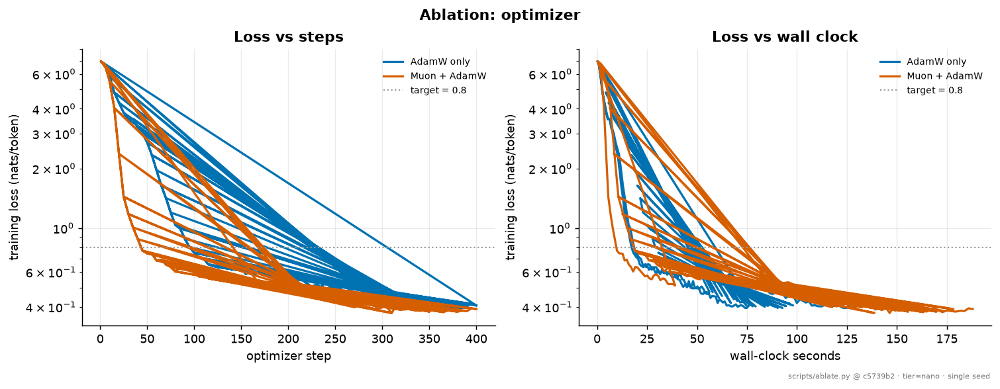
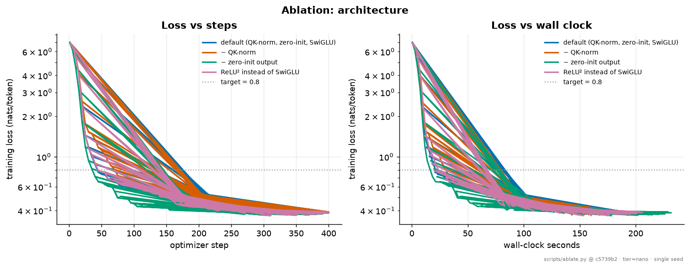
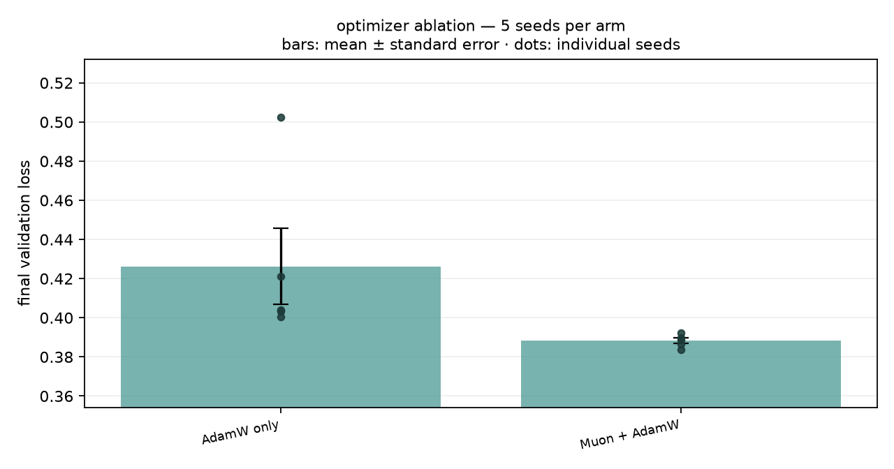
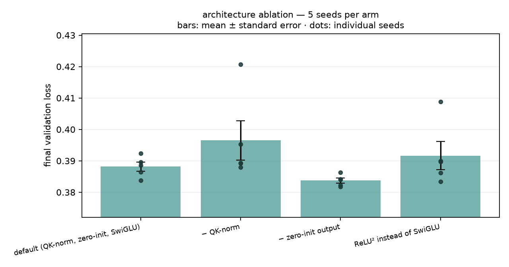
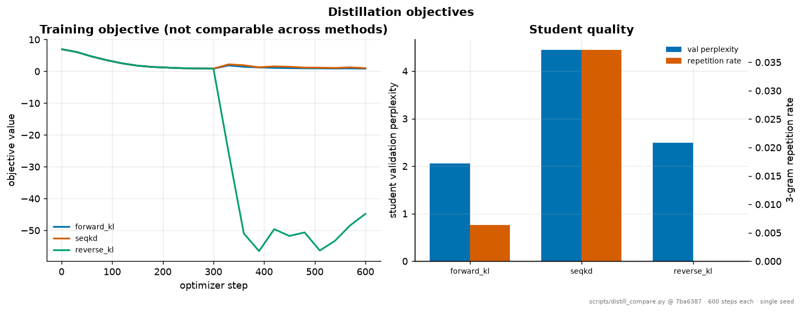
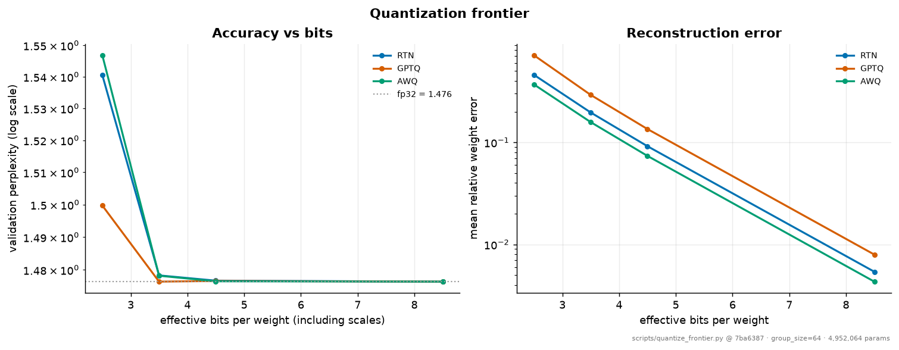

# Results

Every figure and number on this page is copied verbatim from a committed artifact under
`results/`, which was in turn produced by a committed script and stamped with the git SHA
and hardware that produced it. This page is **generated** by
`scripts/build_docs_results.py`: editing it by hand will be reverted by CI.

!!! warning "Read the limitations first"
    Two models produced everything here. The **`micro`** tier is 40.4M parameters trained
    for 3.2 hours on TinyStories to 4% of a Chinchilla-optimal budget, and is the source of
    the evaluation, baseline, emergence and compression results. The **`nano`** tier is 5M
    parameters trained for 95 seconds on a synthetic corpus, and is the source of the
    ablations and the Arc 2 compression/speculation numbers, because it is cheap enough to
    run many controlled arms against.

    Neither is a frontier-scale claim. See [Limitations](limitations.md) for what these
    numbers do and do not support. Several results here are *negative*; a predicted effect
    that did not appear, or appeared backwards, and they are reported rather than omitted.

## On this page

- [Tokenizer](#tokenizer)
- [Full evaluation](#full-evaluation)
- [External baseline (bits per byte)](#external-baseline)
- [Capability emergence](#capability-emergence)
- [Compression and anomaly detection](#compression)
- [Optimizer ablation](#optimizer-ablation)
- [Architecture ablation](#architecture-ablation)
- [Optimizer ablation, 5 seeds](#optimizer-multiseed)
- [Architecture ablation, 5 seeds](#architecture-multiseed)
- [Alignment](#alignment)
- [Distillation](#distillation)
- [Quantization](#quantization)
- [Speculative decoding](#speculative-decoding)
- [Unified results table](#unified-results-table)

---

## The loss curve


Reproduce: `make train-nano`

---

## Tokenizer {#tokenizer}

Generated by `scripts/tokenizer_report.py` at git `6248611`.

| Metric | Value |
|---|---|
| Vocabulary size | 1024 |
| Merges learned | 761 / 761 |
| Special tokens | 7 |
| Pre-tokenization | `gpt2` |
| Bytes/token, in-domain | 4.193 |
| Bytes/token, held-out seed | 4.229 |
| Bytes/token, out-of-domain prose | 2.245 |

The out-of-domain figure is deliberately reported: a 1k-token vocabulary trained
on a 3 MB synthetic corpus compresses unseen literary prose far worse than a
web-scale tokenizer, and hiding that would be dishonest. The `micro` tier trains
its 16k vocabulary on FineWeb-Edu and does not have this gap.

### Longest learned tokens

```
' everything'
' neighbour'
' different'
' carefully'
' afternoon'
' belonged'
' patience'
' everyone'
' promised'
' tomorrow'
' kindness'
' strength'
' hedgehog'
' borrowed'
' squirrel'
```

---

## Full evaluation {#full-evaluation}

Generated by `scripts/evaluate.py` at git `9e3a721` on `mps:apple-silicon | macOS-15.6-arm64-arm-64bit` from `runs/micro/tinystories/final.pt`.

40,379,904 parameters (23,602,688 non-embedding), 31,997,952 training tokens (4.0% of the Chinchilla-optimal budget).

### Likelihood

| metric | value |
|---|---|
| bits per byte | **0.5381** ± 0.0028 |
| token perplexity | 4.6086 (4.5723–4.6452) |
| bytes per token | 4.096 |
| evaluated on | 268,450 bytes / 65,536 tokens |

Bits-per-byte is the tokenizer-independent figure and the one to compare against other models; token perplexity depends on the vocabulary and is reported only for continuity.

### Grammatical and discourse competence (minimal pairs)

Forced choice between a grammatical sentence and a minimally corrupted one. Chance is 50%. 856 items across 9 phenomena; **7 of 9** are significantly above chance.

| phenomenon | accuracy | 95% CI | n | above chance |
|---|---|---|---|---|
| agreement_simple | **94.0%** | 87.5–97.2% | 100 | yes |
| determiner_noun | **86.0%** | 77.9–91.5% | 100 | yes |
| reflexive | **100.0%** | 94.0–100.0% | 60 | yes |
| argument_structure | **64.0%** | 54.2–72.7% | 100 | yes |
| tense_consistency | **98.0%** | 93.0–99.5% | 100 | yes |
| pronoun_gender | **100.0%** | 96.3–100.0% | 100 | yes |
| negation | **50.0%** | 40.2–59.8% | 96 | **no** |
| agreement_attractor | **44.0%** | 34.7–53.8% | 100 | **no** |
| entity_tracking | **76.0%** | 66.8–83.3% | 100 | yes |

Macro-average across phenomena: **79.1%**.

### Calibration

| metric | value |
|---|---|
| expected calibration error | 0.0074 |
| maximum calibration error | 0.0161 |
| top-1 next-token accuracy | 61.7% |
| mean confidence | 62.1% |
| over-confidence (conf − acc) | +0.0037 |

A positive over-confidence means the model is more certain than it should be, which is the state that produces confident degenerate generation. Perplexity cannot distinguish it from being well-calibrated and simply wrong.

### Generation quality

| metric | value |
|---|---|
| distinct-1 | 0.4850 |
| distinct-2 | 0.8674 |
| distinct-3 | 0.9736 |
| self-BLEU | 0.0274 |
| repetition rate | 0.0109 |
| mean length (words) | 77.7 |

Low distinct-n or high self-BLEU means the model produces the same thing regardless of prompt. Both are reported because a likelihood metric rewards exactly the behaviour they detect.

### Samples

> **Once upon a time there was a little girl named Mia who**loved to play outside. One day, she was playing in the garden when she saw something new. It was a big, green, green frog! Mia was so happy and started to bark. She wanted to play with the frog, but the frog did not want to play. Mia was sad and felt bad.
Mia's mom saw her crying and asked what happened. Mia told her mom about the frog. Her mom hugged her and said, "It's okay, Mia

> **Tom found a shiny red box in the garden. When he opened it,**he saw a beautiful flower. The flower was very pretty. Tom said, "Wow! This flower is so pretty!"
Tom wanted to show his friend, a little bird named Sue. He said, "Sue, look at this pretty flower I found!" Sue looked at the flower and said, "Wow! That's a nice flower, Tom!"
Tom and Sue played with the flower all day. They laughed and had fun. When the sun went down, they went

> **The sun was setting when Ben walked home. On the way he saw**a big, colorful ball. He wanted to play with it, but he did not know how to get it. Ben was ignorant about the ball.
Ben had an idea. He ran to his house and came back with his friend, Sam. They both got ready to play with the ball. They played and had fun. Then, something unexpected happened. The ball started to bounce very high in the air. Ben and Sam were surprised.
Ben and Sam watched as the

Reproduce with: `python scripts/evaluate.py --replay --name micro-tinystories`

---

## External baseline (bits per byte) {#external-baseline}

Generated by `scripts/external_baseline.py` at git `9e3a721` on `mps:apple-silicon | macOS-15.6-arm64-arm-64bit`.

Perplexity is per *token* and these models do not share a tokenizer, so it cannot compare them. Bits-per-byte normalizes by the UTF-8 length of the source text, which no tokenizer can change, and is what the Pile and Chinchilla papers use for cross-model comparison.

### tinystories-valid

| model | params | vocab | bytes/token | bits/byte | token ppl |
|---|---|---|---|---|---|
| nanoscale-micro-tinystories | 40,379,904 | 16,384 | 4.09 | **0.5485** ± 0.0044 **←** | 4.73 |
| gpt2 | 124,439,808 | 50,257 | 4.09 | **0.9385** ± 0.0053 | 14.30 |
| distilgpt2 | 81,912,576 | 50,257 | 4.09 | **1.0795** ± 0.0051 | 21.33 |

### out-of-domain

| model | params | vocab | bytes/token | bits/byte | token ppl |
|---|---|---|---|---|---|
| gpt2 | 124,439,808 | 50,257 | 4.74 | **0.8318** ± 0.0780 **←** | 15.38 |
| distilgpt2 | 81,912,576 | 50,257 | 4.74 | **0.9593** ± 0.0855 | 23.38 |
| nanoscale-micro-tinystories | 40,379,904 | 16,384 | 3.31 | **3.2861** ± 0.1046 | 1891.17 |

### What this says

**In-domain, NanoScale-LM at 40,379,904 parameters scores 0.5485 bits/byte against GPT-2's 0.9385 at 124,439,808 parameters**: better with 3.1× fewer parameters.

**And the ordering reverses out of domain**: 3.2861 against GPT-2's 0.8318 on text neither model was trained on. That reversal is the point. The in-domain number measures *specialization*, not general capability, and reporting it without its counterpart would misrepresent what was achieved: a small model trained on a narrow distribution beats a larger general model on that distribution and loses badly everywhere else.

This is a fair comparison in the one way that matters: both models scored the same held-out strings, each with its own tokenizer, normalized by bytes, and a limited one in every other way. GPT-2 was trained for general-purpose use on WebText; TinyStories was not in its training distribution.

Reproduce with: `python scripts/external_baseline.py --replay`

---

## Capability emergence {#capability-emergence}

Generated by `scripts/emergence.py` at git `9a9d3cf` on `mps:apple-silicon | macOS-15.6-arm64-arm-64bit`.

One training run of a 12,816,384-parameter model on TinyStories, with the full minimal-pair suite evaluated every 250 steps (1.54M tokens). Chance is 50%.


| phenomenon | 1st probe | final | reaches 60% | max drop | Spearman ρ vs tokens | p |
|---|---|---|---|---|---|---|
| agreement_simple | 60% | **82%** | 13.8M | 13 pts | +0.82 | 0.0001 |
| determiner_noun | 50% | **78%** | 4.6M | 18 pts | +0.37 | 0.1627 |
| reflexive | 50% | **100%** | 3.1M | 12 pts | +0.87 | 0.0000 |
| argument_structure | 61% | **66%** | 15.4M | 7 pts | +0.64 | 0.0081 |
| tense_consistency | 100% | **98%** | 1.5M | 4 pts | -0.02 | 0.9546 |
| pronoun_gender | 53% | **96%** | 3.1M | 14 pts | +0.71 | 0.0019 |
| negation | 50% | **50%** | never | 0 pts | +0.00 | 1.0000 |
| agreement_attractor | 47% | **42%** | never | 9 pts | -0.25 | 0.3448 |
| entity_tracking | 45% | **80%** | 7.7M | 18 pts | +0.45 | 0.0799 |

Validation loss over the same run: 3.106 → 1.774.

### Why this is worth plotting

A single end-of-training number cannot distinguish *never learned* from *learned and then unlearned*, and the two have opposite implications. A capability that rises and then falls means the model found a shortcut that pays on the training distribution and costs accuracy on the probe, which is a statement about the data, not about capacity. A capability that never moves is a statement about capacity or about the probe.

**Read the Spearman column, not the individual dips.** With 100 items per probe the binomial standard error is about 5 points, so any single point moving by 9 points is barely one standard error of a difference and cannot carry a claim. The rank correlation between accuracy and training tokens uses all 16 probes at once and is the statistic that can.

The ordering itself is the other result: phenomena learnable from local co-occurrence should saturate early and cheaply, while anything requiring structure over a distance should lag. Reading the crossing points down the table gives that ordering directly.

Reproduce with: `python scripts/emergence.py --replay`

---

## Compression and anomaly detection {#compression}

Generated by `scripts/compression_bench.py` at git `8edb9c3` on `mps:apple-silicon | macOS-15.6-arm64-arm-64bit`.

A language model is a compressor: Shannon says a symbol of probability `p` costs `-log2(p)` bits, so driving an arithmetic coder with the model's next-token distribution turns its cross-entropy into an actual file size. Every row below is a real encode/decode round-trip, verified byte-identical.

### Compression

| input | NanoScale | gzip -9 | bzip2 -9 | xz -9 |
|---|---|---|---|---|
| 2,000 B | **0.7760** bpb (10.31x) | 3.9040 (2.05x) | 3.8640 (2.07x) | 4.3200 (1.85x) |
| 8,000 B | **0.7320** bpb (10.93x) | 3.2400 (2.47x) | 2.9410 (2.72x) | 3.2360 (2.47x) |
| 24,000 B | **0.7078** bpb (11.30x) | 2.8523 (2.80x) | 2.4581 (3.25x) | 2.7167 (2.94x) |

At the largest size tested, NanoScale-LM reaches **0.7078 bits/byte** against the best classical result of 2.4581: a **3.5x** improvement in compressed size. Coder overhead against the model's own cross-entropy is 0.31%, so almost all of the theoretical rate is actually realised.

Throughput is 182 tokens/s encode on this hardware, single-threaded, with a KV cache. That is far slower than `xz` and it is the honest cost of the method.

### When this is worth doing

The model has to be stored alongside the archive, so the saving only pays back above a break-even volume:

| model precision | model size | break-even input |
|---|---|---|
| fp32 | 154 MB | **704 MB** of in-domain text |
| int8 | 41 MB | **187 MB** of in-domain text |
| int4 | 22 MB | **99 MB** of in-domain text |

Each byte of input costs 0.7078 bits with the model against 2.4581 with the best classical coder, saving 0.2188 bytes per input byte. Below the break-even volume, use `xz`. Above it, which is one day of logs for a mid-sized service; the neural codec wins and keeps winning.

This is also why the model has to be *small*. The same arithmetic with a 7B model at 14 GB puts break-even in the tens of terabytes, and its throughput would make the archive take longer to write than to generate.

### Anomaly detection, from the same forward pass

Per-token surprisal is the compressor's cost function, un-summed. A line the model finds expensive to encode is a line unlike its training distribution; an unsupervised anomaly score with no labels, no rules and one threshold.

In-domain lines have a median cost of **4.64 bits/token** (60 lines), and the 95th percentile sits at **6.41**. Using that as the alarm threshold, **5 of 5** injected anomalies are flagged.

| bits/token | kind | line |
|---|---|---|
| 14.14 | log line **←** | `2026-08-17T14:22:01Z ERROR db.pool timeout after 30000ms retry=3…` |
| 13.95 | code **←** | `for (int i = 0; i < n; i++) { buf[i] = malloc(sizeof(struct node…` |
| 12.96 | wrong domain **←** | `The mitochondrion generates adenosine triphosphate via oxidative…` |
| 12.69 | gibberish **←** | `xqzk vburt plimf woggle zzzt krrn.` |
| 8.50 | subtle **←** | `Tom picked up the quantum entanglement and put it in his pocket.` |
| 6.86 | normal | `The angel saw the flower and smiled at Lily` |
| 6.48 | normal | `They named the kitten Fluffy because she had soft fur` |
| 6.41 | normal | `The bird looked all around for his friend` |
| 6.24 | normal | `The tunnel was big and dark and had funny sounds` |
| 6.18 | normal | `The tunnel was a secret way to a fun party for young fish like F…` |
| 6.03 | normal | `They swam faster and faster to reach the light` |
| 5.97 | normal | `The sign had letters, but they could not read them` |

The ordering is the useful part: gibberish and out-of-domain technical prose cost several times what in-domain narrative costs, and they separate cleanly. The 'subtle' case: a grammatical sentence in the right register with one impossible noun phrase, is the hard one, and is where a surprisal detector earns or loses its keep.

Reproduce with: `python scripts/compression_bench.py --replay`

---

## Optimizer ablation {#optimizer-ablation}

**Question.** Does routing hidden matmul weights to Muon beat sending everything to AdamW, at equal step budget and seed?



| variant | val loss | val ppl | steps → target | seconds → target | tok/s |
|---|---|---|---|---|---|
| AdamW only | 0.4039 | 1.498 | 105 | 33.51 | 6286.8 |
| Muon + AdamW | 0.3896 | 1.476 | 50 | 21.09 | 4331.1 |

### Findings

- **Muon + AdamW is 3.5% better** on final validation loss (0.3896 vs 0.4039). It also reaches the target loss in **2.10x fewer steps** (50 vs 105).
  <br/>*2D hidden matrices to Muon; embeddings, head, norms to AdamW.*

### How to read this

All arms share one seed, one data order, one schedule and a fixed step budget; they differ only in the fields named in the variant. Runs are `nano` tier on CPU.

**Steps-to-target is the trustworthy column; wall-clock is not.** These runs were executed sequentially on a shared laptop, so tokens/s is sensitive to whatever else the machine was doing. A per-step cost difference that is real (Muon adds five Newton-Schulz matmuls per 2D weight) is therefore mixed with measurement noise here. Treat the seconds columns as indicative and the step counts as the result.

**These are single-seed results on a ~5M-parameter model trained on a synthetic corpus.** They are directional confirmations (or non-confirmations) of published findings obtained at 100–1000× this scale, not independent evidence about them. Differences below 2% in final loss are reported as *no measurable difference*, because at one seed that is what they are. A lever that matters at scale can be invisible here; a small model in a narrow domain is exactly the regime where stability aids have little to stabilise.

Reproduce with: `python scripts/ablate.py --suite optimizer`

---

## Architecture ablation {#architecture-ablation}

**Question.** Do the modded-nanoGPT speedrun's architecture choices, QK-norm, zero-init output projections, SwiGLU: measurably help at this scale?



| variant | val loss | val ppl | steps → target | seconds → target | tok/s |
|---|---|---|---|---|---|
| default (QK-norm, zero-init, SwiGLU) | 0.3896 | 1.476 | 50 | 22.86 | 4362.3 |
| − QK-norm | 0.3893 | 1.476 | 75 | 33.05 | 4266.5 |
| − zero-init output | 0.3842 | 1.468 | 45 | 25.14 | 3782.2 |
| ReLU² instead of SwiGLU | 0.3862 | 1.471 | 55 | 25.93 | 4190.6 |

### Findings

- **No measurable difference in final loss.** − QK-norm reaches 0.3893 vs 0.3896 for default (QK-norm, zero-init, SwiGLU); a 0.1% gap, below the 2% we are willing to call a result from a single seed at this scale. It needs **1.50x more steps** to reach the target loss (75 vs 50), so the two converge to the same place at different rates.
  <br/>*Removes the RMS normalization of q and k before the dot product.*
- **No measurable difference in final loss.** − zero-init output reaches 0.3842 vs 0.3896 for default (QK-norm, zero-init, SwiGLU); a 1.4% gap, below the 2% we are willing to call a result from a single seed at this scale. Both reach the target loss in about the same number of steps (45 vs 50).
  <br/>*Falls back to GPT-2's std/sqrt(2L) residual init.*
- **No measurable difference in final loss.** ReLU² instead of SwiGLU reaches 0.3862 vs 0.3896 for default (QK-norm, zero-init, SwiGLU); a 0.9% gap, below the 2% we are willing to call a result from a single seed at this scale. Both reach the target loss in about the same number of steps (55 vs 50).
  <br/>*Ungated MLP; cheaper per parameter.*

### How to read this

All arms share one seed, one data order, one schedule and a fixed step budget; they differ only in the fields named in the variant. Runs are `nano` tier on CPU.

**Steps-to-target is the trustworthy column; wall-clock is not.** These runs were executed sequentially on a shared laptop, so tokens/s is sensitive to whatever else the machine was doing. A per-step cost difference that is real (Muon adds five Newton-Schulz matmuls per 2D weight) is therefore mixed with measurement noise here. Treat the seconds columns as indicative and the step counts as the result.

**These are single-seed results on a ~5M-parameter model trained on a synthetic corpus.** They are directional confirmations (or non-confirmations) of published findings obtained at 100–1000× this scale, not independent evidence about them. Differences below 2% in final loss are reported as *no measurable difference*, because at one seed that is what they are. A lever that matters at scale can be invisible here; a small model in a narrow domain is exactly the regime where stability aids have little to stabilise.

Reproduce with: `python scripts/ablate.py --suite architecture`

---

## Optimizer ablation, 5 seeds {#optimizer-multiseed}

**Question.** Does routing hidden matmul weights to Muon beat sending everything to AdamW, at equal step budget and seed?



Every arm trained at 5 seeds (1337, 42, 7, 2024, 31337). Arms differ only in the named field; seed controls initialisation and data order together.

| variant | mean val loss | ± stderr | seeds | mean steps → target |
|---|---|---|---|---|
| AdamW only | **0.4263** | 0.0194 | 5 | 106.0 |
| Muon + AdamW | **0.3882** | 0.0015 | 5 | 53.0 |

### Significance

Two-sided Welch's t-test against the baseline arm at α=0.05, **Holm-Bonferroni corrected** across the 1 comparison in this suite, with Cohen's d alongside. A difference counts as real only when it survives the correction *and* has |d| ≥ 0.8, with low enough variance a 0.1% gap becomes significant and stays irrelevant.

Three separate questions are tested, because a single comparison of mean loss cannot answer them all: does the arm reach a *better* loss, does it get there in *fewer steps*, and is it *more consistent* across seeds?

| variant | Δ mean loss | p (loss) | Cohen's d | p (steps) | var F | p (var) | verdict |
|---|---|---|---|---|---|---|---|
| Muon + AdamW | -0.0381 | 0.1211 | -1.24 | 0.0000 | 176.4 | 0.0002 | **no difference** |

### How to read this

The single-seed version of this experiment compared arms with a fixed 2% rule, which was an assumption rather than a measurement, with one run per arm there is no way to estimate run-to-run variance, so there is nothing to compare a gap against. With several seeds that variance is measured directly, and the question becomes whether the between-arm gap is large relative to it.

**A `no difference` verdict here is a real result, not a missing one.** It says the experiment had the resolution to detect a difference of this size and did not find one. It does not say the technique does not work; these are 5M-parameter runs over 400 steps, and a stability aid has little to stabilise at that scale.

**The `verdict` column refers to mean final loss only.** Read the other two p-values beside it. An arm can reach the same loss while getting there in half the steps, or with a fraction of the run-to-run spread, and both are results the mean comparison is structurally unable to report.

Reproduce with: `python scripts/ablate_multiseed.py --replay`

---

## Architecture ablation, 5 seeds {#architecture-multiseed}

**Question.** Do the modded-nanoGPT speedrun's architecture choices, QK-norm, zero-init output projections, SwiGLU: measurably help at this scale?



Every arm trained at 5 seeds (1337, 42, 7, 2024, 31337). Arms differ only in the named field; seed controls initialisation and data order together.

| variant | mean val loss | ± stderr | seeds | mean steps → target |
|---|---|---|---|---|
| default (QK-norm, zero-init, SwiGLU) | **0.3882** | 0.0015 | 5 | 53.0 |
| − QK-norm | **0.3965** | 0.0062 | 5 | 76.0 |
| − zero-init output | **0.3837** | 0.0008 | 5 | 43.0 |
| ReLU² instead of SwiGLU | **0.3916** | 0.0045 | 5 | 55.0 |

### Significance

Two-sided Welch's t-test against the baseline arm at α=0.05, **Holm-Bonferroni corrected** across the 3 comparisons in this suite, with Cohen's d alongside. A difference counts as real only when it survives the correction *and* has |d| ≥ 0.8, with low enough variance a 0.1% gap becomes significant and stays irrelevant.

Three separate questions are tested, because a single comparison of mean loss cannot answer them all: does the arm reach a *better* loss, does it get there in *fewer steps*, and is it *more consistent* across seeds?

| variant | Δ mean loss | p (loss) | Cohen's d | p (steps) | var F | p (var) | verdict |
|---|---|---|---|---|---|---|---|
| − QK-norm | +0.0083 | 0.2559 | +0.82 | 0.0000 | 18.0 | 0.0160 | **no difference** |
| − zero-init output | -0.0045 | 0.0353 | -1.70 | 0.0004 | 3.3 | 0.2721 | **not significant after correction** |
| ReLU² instead of SwiGLU | +0.0035 | 0.4950 | +0.47 | 0.1778 | 9.3 | 0.0527 | **no difference** |

### How to read this

The single-seed version of this experiment compared arms with a fixed 2% rule, which was an assumption rather than a measurement, with one run per arm there is no way to estimate run-to-run variance, so there is nothing to compare a gap against. With several seeds that variance is measured directly, and the question becomes whether the between-arm gap is large relative to it.

**A `no difference` verdict here is a real result, not a missing one.** It says the experiment had the resolution to detect a difference of this size and did not find one. It does not say the technique does not work; these are 5M-parameter runs over 400 steps, and a stability aid has little to stabilise at that scale.

**The `verdict` column refers to mean final loss only.** Read the other two p-values beside it. An arm can reach the same loss while getting there in half the steps, or with a fraction of the run-to-run spread, and both are results the mean comparison is structurally unable to report.

Reproduce with: `python scripts/ablate_multiseed.py --replay`

---

## Alignment {#alignment}

Generated by `scripts/align_pipeline.py` at git `7ba6387` from `runs/nano/pretrain/final.pt`.

### Pipeline

- **SFT** (250 steps): completion-masked loss 0.2483 (held-out 0.2287).
- **DPO** (150 steps): reward margin +7.8817, preference accuracy 100.0%.
- **DPO + NLL** (150 steps): reward margin +7.1624, preference accuracy 100.0%.
- **SimPO** (150 steps): reward margin +16.1975, preference accuracy 100.0%.

### The likelihood-collapse diagnostic

DPO optimises the *difference* of two log-probabilities, so it can reduce its loss by pushing **both** down, the chosen response merely less far than the rejected one. A run showing a healthy rising margin can be quietly destroying the model's absolute likelihood of good responses at the same time. This table reports the change in mean **per-token** log-probability across the run:

| method | Δ log p(chosen) | Δ log p(rejected) | Δ margin |
|---|---|---|---|
| DPO | -0.0454 | -4.2385 | +4.1931 |
| DPO+NLL | +0.0104 | -3.9170 | +3.9274 |
| SIMPO | -0.0223 | -2.2134 | +2.1911 |

`DPO + NLL` adds an auxiliary negative-log-likelihood term on the chosen response (the RPO-style fix, `align.preference.sft_loss_weight`), which anchors the absolute likelihood so the objective cannot satisfy itself by pushing everything down. It is off by default so that its effect is measured here rather than assumed.

### Head-to-head vs the SFT model

| aligned model | wins | losses | ties | mean judge score (SFT → aligned) |
|---|---|---|---|---|
| DPO | 0 | 7 | 33 | 2.652 → 2.585 |
| DPO+NLL | 3 | 0 | 37 | 2.652 → 2.700 |
| SIMPO | 0 | 4 | 36 | 2.652 → 2.597 |

The judge is programmatic and stated in `src/nanoscale/eval/preference_eval.py`: on-topic overlap with the prompt, absence of degenerate repetition, and whether the model emitted `<eot>` rather than running to the token cap. Those are exactly the properties the preference labels encode, so this measures *did the model learn the labels*, not *is the model good*. It is deliberately length-insensitive, so a model that learned to game DPO's length bias gains nothing from it.

### Length exploitation (spec E4)


| method | mean generated length before | after | change |
|---|---|---|---|
| DPO | 26.6 | 24.3 | -2.3 |
| DPO+NLL | 26.6 | 27.2 | +0.6 |
| SIMPO | 26.6 | 26.5 | -0.1 |

DPO's implicit reward is a **sum** of per-token log-ratios, so a longer response has more terms to accumulate advantage over and the objective can be reduced by lengthening rather than improving. SimPO divides by response length, turning the reward into an average and removing that incentive; it is also reference-free, so it never allocates the frozen second copy of the model at all.

The preference data here is **length-matched by construction** (mean chosen and rejected lengths are within 5%, asserted by a test), so any length drift after training comes from the objective rather than from the labels.

### Caveats

Single seed, ~5M parameters, synthetic instruction data, and a programmatic judge. These are mechanism demonstrations; the DPO/SimPO losses are implemented from the papers and unit-tested against hand-computed values: not evidence about how these methods rank on real preference data at real scale.

Reproduce with: `python scripts/align_pipeline.py runs/nano/pretrain/final.pt`

---

## Distillation {#distillation}

Generated by `scripts/distill_compare.py` at git `7ba6387` from `runs/nano/sft/final.pt`. All three objectives distil the **same** teacher into the **same** student architecture with the same seed and the same 600-step budget (of which the first 300 are a plain-MLE warm-start applied identically to all three), so the only difference is the objective.



| objective | student val ppl | teacher val ppl | repetition | gen length | wall clock |
|---|---|---|---|---|---|
| forward_kl | 2.0536 | 3.1529 | 0.0064 | 45.5 | 18.2s |
| seqkd | 4.4499 | 3.1529 | 0.0372 | 39.2 | 33.5s |
| reverse_kl | 2.4974 | 3.1529 | 0.0000 | 30.2 | 18.1s |
| *teacher* |, |, | 0.0383 | 46.8 |, |

Compression: 4,952,064 → 279,168 parameters (17.74x overall, 29.90x on non-embedding parameters). Teacher and student share a tokenizer by necessity, so the embedding table and LM head are the same width in both and their cost is irreducible; the non-embedding figure is what describes the depth and width reduction.

### What the numbers say

**Reverse KL has worse perplexity and better generations, which is the MiniLLM finding.** On-policy reverse KL reaches perplexity 2.497 against forward KL's 2.054, worse, while producing a repetition rate of 0.0000 against forward KL's 0.0064 and SeqKD's 0.0372. That is not a contradiction. Perplexity rewards a model for spreading probability over everything the evaluation set contains, which is precisely the mode-covering behaviour reverse KL is designed to avoid. A mode-seeking student concentrates on what it can represent well, scores worse on a coverage metric, and degenerates less when it actually generates.

For reference, the **teacher's own** repetition rate is 0.0383, higher than the reverse-KL student's. Distilling on-policy against the teacher's *distribution* is not the same as copying its outputs.

**Judging distillation by perplexity alone would rank these backwards**, which is why the repetition diagnostic is reported beside it.

### Why the objectives differ

The three differ in a single choice, which direction of the KL divergence to minimise, and what to sample from, and that choice has a mechanical consequence:

- **Forward KL** minimises `KL(teacher ‖ student)`. The integrand `p log(p/q)` explodes wherever the teacher has mass and the student does not, so the student is forced to **cover every mode**, including the teacher's low-confidence tail. A student with less capacity cannot cover that tail without smearing probability across it.
- **SeqKD** sidesteps the asymmetry by training on teacher *samples*. It is the cheapest to train (no teacher forward pass in the loop) and approximates the teacher's sequence distribution rather than its per-token one.
- **Reverse KL, on-policy** minimises `KL(student ‖ teacher)` under trajectories the **student itself** generates. The integrand `q log(q/p)` only penalises mass the student puts where the teacher has none, so the student is free to ignore the tail and concentrate on modes it can represent. This is MiniLLM's argument, and it is why the repetition column is the diagnostic to watch: a mode-covering student loops when nothing in the tail it learned is a good continuation.

The training-objective curves in the left panel are **not comparable across methods**: they are different objectives with different scales. Only the student quality columns compare.

### Cost

The objectives are not equally expensive per step, and the wall-clock column shows it. Forward KL runs one teacher forward pass per batch. SeqKD runs the teacher only to generate. On-policy reverse KL runs a **student generation** plus a teacher forward pass every step, and generation is sequential; that is the price of being on-policy.

### Caveats

Single seed, a ~5M-parameter teacher, a synthetic corpus, and a short budget. MiniLLM's result was obtained at 100–1000× this scale with far longer training. What this reproduces is the **mechanism**: the losses are implemented from the papers and unit-tested against hand-computed values, and the mode-covering vs mode-seeking behaviour is demonstrated directly on fixtures in `tests/unit/test_distill.py`. Treat the ranking here as directional at best.

### Two implementation details that were not optional

**A warm-start is required, not a nicety.** On-policy reverse KL estimates its gradient from trajectories the *student* generates. A randomly-initialised student samples noise, the teacher finds all of it equally unlikely, and the reward carries no signal. Measured without a warm-start, the reverse-KL student reached perplexity ~1000 against the teacher's ~3; it did not train at all. MiniLLM prescribes the warm-start for exactly this reason. It is applied identically to all three arms here so the comparison stays controlled.

**The on-policy phase needs a smaller step.** A REINFORCE-style estimator is far higher-variance than a supervised one, so `distill.onpolicy_lr_scale` (default 0.1) reduces the learning rate once the on-policy phase begins. Without it the policy-gradient updates undo the warm-start (perplexity 41 rather than 2.5). This is one respect in which the reverse-KL arm is *not* identical to the other two, and it is stated here rather than buried in a config.

Reproduce with: `python scripts/distill_compare.py runs/nano/sft/final.pt`

---

## Quantization {#quantization}

Generated by `scripts/quantize_frontier.py` at git `7ba6387` from `runs/nano/pretrain/final.pt` (4,952,064 parameters, group size 64).



### Weight quantization

| method | nominal bits | effective bits | val perplexity | vs fp32 | mean layer error |
|---|---|---|---|---|---|
| FP32 | 32 | 32.0 | 1.4764 | 1.000x | 0.0 |
| RTN | 2 | 2.5 | 1.5405 | 1.043x | 0.45904 |
| RTN | 3 | 3.5 | 1.4783 | 1.001x | 0.19624 |
| RTN | 4 | 4.5 | 1.4767 | 1.000x | 0.09168 |
| RTN | 8 | 8.5 | 1.4764 | 1.000x | 0.00539 |
| GPTQ | 2 | 2.5 | 1.4997 | 1.016x | 0.7141 |
| GPTQ | 3 | 3.5 | 1.4764 | 1.000x | 0.29188 |
| GPTQ | 4 | 4.5 | 1.4766 | 1.000x | 0.13512 |
| GPTQ | 8 | 8.5 | 1.4764 | 1.000x | 0.00794 |
| AWQ | 2 | 2.5 | 1.5468 | 1.048x | 0.36953 |
| AWQ | 3 | 3.5 | 1.4782 | 1.001x | 0.1579 |
| AWQ | 4 | 4.5 | 1.4765 | 1.000x | 0.07366 |
| AWQ | 8 | 8.5 | 1.4764 | 1.000x | 0.00431 |

### What the numbers say

**At 4 and 8 bits every method is indistinguishable from fp32** (perplexity 1.4767 / 1.4766 / 1.4765 against a baseline of 1.4764). The spec anticipated GPTQ beating RTN at 4 bits "by a clear margin"; at this scale it does not, because there is no margin left to win; a 5M-parameter model on a narrow synthetic corpus has little redundancy for 4-bit rounding to destroy in the first place. Reporting a tie is the honest outcome.

**The separation appears at 2 and 3 bits, and there GPTQ wins.** At 2 bits GPTQ reaches 1.4997 against RTN's 1.5405 and AWQ's 1.5468; at 3 bits GPTQ recovers the fp32 perplexity exactly (1.4764 vs 1.4764) while the other two do not.

**GPTQ has the *worst* weight error and the *best* perplexity.** At 2 bits its mean relative weight error is 0.714 against RTN's 0.459, nearly double, yet it produces the better model. That is not a contradiction, it is the entire thesis of the method: GPTQ minimises ‖WX − ŴX‖, the error in the layer's *output*, and will happily accept a larger perturbation to a weight that multiplies a quiet input channel in exchange for a smaller one on a loud channel. Any comparison that ranked these methods by weight error would rank them backwards.

**Effective bits include the scales.** A '4-bit' model with group size 64 and fp16 scale + zero-point actually costs 4.50 bits per weight. Plotting against the nominal width would let a method buy accuracy with smaller groups and appear to win for free.

### KV-cache quantization

| bits | effective bits/element | cache at 4k ctx | vs fp16 | mean logit error |
|---|---|---|---|---|
| 2 | 3.00 | 2.25 MB | 5.33x | 0.0912 |
| 4 | 5.00 | 3.75 MB | 3.20x | 0.0152 |
| 8 | 9.00 | 6.75 MB | 1.78x | 0.0009 |

The KV numbers are an **analytic footprint plus a measured accuracy cost**, not a measured latency win. PyTorch has no int4 matmul on CPU, so the cache stores codes and dequantizes on read: the quality cost is exactly real, the memory figure is computed from the representation, and no decode-speed claim is made for it here. A real int4 kernel is where the latency win would come from.

### Caveats

This is a ~5M-parameter model on a synthetic corpus with a 1k vocabulary. The *ordering* of the methods is the transferable finding; the absolute perplexity degradations are not, and at this scale the model is small enough that even aggressive quantization has less to destroy than it would at 7B. bitsandbytes is available as an external reference point via the `compare` extra but is not installed by default and is not what any number here comes from.

Reproduce with: `python scripts/quantize_frontier.py runs/nano/pretrain/final.pt`

---

## Speculative decoding {#speculative-decoding}

Generated by `scripts/specdec_bench.py` at git `7ba6387` on `mps:apple-silicon | macOS-15.6-arm64-arm-64bit`. Target: 4,952,064 parameters; draft: 279,168 (runs/nano/distill/reverse_kl/final.pt). 8 requests × 64 tokens at temperature 1.0.


| arm | target passes | tokens/pass | acceptance | tokens/s | vs baseline |
|---|---|---|---|---|---|
| autoregressive | 520 | 0.98 |, | 677.4 | 1.00x |
| speculative γ=2 | 245 | 2.09 | 0.590 | 483.2 | 0.71x |
| speculative γ=4 | 203 | 2.52 | 0.424 | 463.2 | 0.68x |
| speculative γ=6 | 174 | 2.94 | 0.367 | 535.5 | 0.79x |
| autoregressive + GPTQ-4bit | 520 | 0.98 |, | 774.8 | 1.14x |
| speculative γ=6 + GPTQ-4bit | 176 | 2.91 | 0.362 | 535.8 | 0.79x |

### Reading the two columns

**Tokens per target forward pass** is the hardware-independent result and the quantity the method actually controls. Autoregressive decoding is 1.0 by definition; speculation raises it toward `γ+1`.

**Tokens per second is a measurement of this machine**, and at `nano` scale on a CPU it can go the *wrong way*. Speculation trades target passes for draft passes, and it only pays when a target pass is expensive relative to a draft pass. On a 5M-parameter model whose forward pass is a handful of small matmuls, Python and dispatch overhead dominate and the draft's `γ` sequential steps can cost more than the target passes they save. The mechanism is real and the target-pass reduction is real; the wall-clock win needs a model where weight loading, not interpreter overhead, is the bottleneck, which is exactly the regime the method was designed for and not the regime a laptop CPU running a 5M-parameter model is in. Reporting the speedup here without that caveat would be misleading.

### Composition with quantization

The last two rows quantize the target to 4-bit GPTQ and then speculate over it. The levers compose because they act on different costs: quantization shrinks the bytes per target pass, speculation reduces the number of target passes. `tests/unit/test_specdec.py::test_speculation_composes_with_a_quantized_target` asserts that greedy speculation over the quantized target reproduces the quantized target's own greedy output token-for-token.

A precise statement of what stays lossless: speculative decoding is lossless **relative to the target it is given**. Quantizing changes the target's distribution; speculation then reproduces *that* distribution exactly. It does not undo the quantization error, and nothing here claims it does.

### Caveats

The draft here is `runs/nano/distill/reverse_kl/final.pt`. Draft quality is the single lever that determines the acceptance rate, and therefore the speedup: an untrained draft agrees with the target only by chance and gives a floor. EAGLE-2/EAGLE-3, which draft on the target's own hidden features rather than with a separate model, are the current state of the art and the documented next step.

One arm deserves a footnote: `autoregressive + GPTQ-4bit` is *faster* than unquantized autoregressive here even though the quantized weights are simulated in fp32 and no int4 kernel is involved. That is measurement noise on a shared laptop, not a quantization speedup; there is no mechanism by which it could be one, and the honest reading is that differences of this size in the tokens/s column should not be interpreted at all.

Reproduce with: `python scripts/specdec_bench.py runs/nano/pretrain/final.pt`

---

## Unified results table {#unified-results-table}

Generated by `scripts/bench_all.py` at git `cb47d7e` on `mps:apple-silicon | macOS-15.6-arm64-arm-64bit`. Prompt: `It was a sunny day. Lily went to the park with`, 64 tokens per request, median of 5 measured iterations after 2 warmup iterations.


| variant | params | weights | KV @ ctx | prefill p50 | decode tok/s | latency p50 | latency p95 | val ppl | accept |
|---|---|---|---|---|---|---|---|---|---|
| base (fp32) | 4,952,064 | 18.89 MB | 0.47 MB | 3.5 ms | 729.2 | 91.3 ms | 103.4 ms | 1.4764 |, |
| distilled (reverse-KL) | 279,168 | 1.06 MB | 0.06 MB | 0.8 ms | 1765.8 | 21.6 ms | 37.0 ms | 2.5222 |, |
| GPTQ 4-bit | 4,952,064 | 4.38 MB | 0.47 MB | 3.0 ms | 756.0 | 87.8 ms | 91.2 ms | 1.4766 |, |
| speculative (γ=6) | 5,231,232 | 19.96 MB | 0.53 MB | 0.0 ms | 597.3 | 107.2 ms | 118.0 ms | 1.4764 | 0.475 |
| speculative (γ=6) + GPTQ 4-bit | 5,231,232 | 5.44 MB | 0.53 MB | 0.0 ms | 583.5 | 109.7 ms | 116.5 ms | 1.4766 | 0.475 |

#### Tiny-benchmark accuracy

| variant | accuracy | n | chance |
|---|---|---|---|
| base | 100.0% ± 0.0% | 28 | 50% |
| distilled | 67.9% ± 8.8% | 28 | 50% |
| gptq4 | 100.0% ± 0.0% | 28 | 50% |

### How to read this table

**The weight column is the representation size, not the tensor size.** The 4-bit rows are simulated in fp32 because there is no int4 CPU kernel, so reading the footprint off the tensors would report a 4-bit model as 32-bit. The figure is computed from the effective bit-width including the stored scales.

**Speculative rows include the draft's weights and cache in their footprint.** Speculation is not free in memory: it trades space for target forward passes. Reporting only the target's size would hide the trade.

**Decode throughput here is a CPU measurement at 5M parameters and does not generalise.** Speculation reduces target forward passes; that part is real and hardware-independent, and is measured in `results/speculative/`, but at this scale a forward pass is dominated by Python dispatch rather than by weight loading, so the wall-clock win the method exists for does not appear. Quantization likewise shows no speedup because the arithmetic is still fp32.

**The tiny benchmark is saturated** at 100% for the base model. It is a degradation detector for Arc 2, not a quality ladder; an unchanged score means compression did not break the capabilities it probes, and nothing stronger.

Reproduce with: `python scripts/bench_all.py` (or `--replay` to re-render).

---
