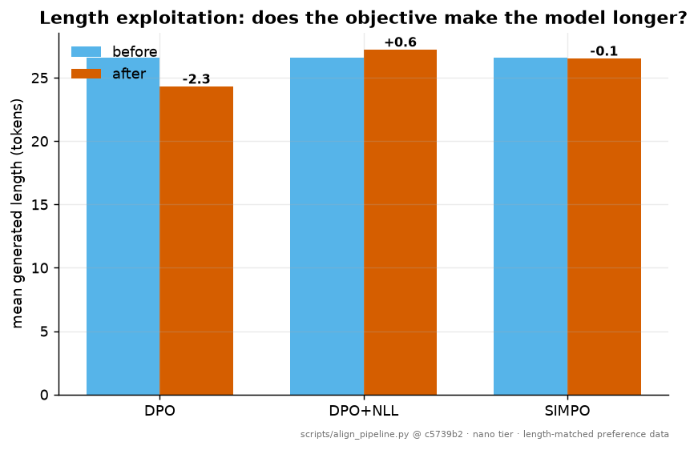

# Alignment — SFT, DPO and SimPO

Generated by `scripts/align_pipeline.py` at git `c5739b2` from `runs/nano/pretrain/final.pt`.

## Pipeline

- **SFT** (250 steps): completion-masked loss 0.2483 (held-out 0.2287).
- **DPO** (150 steps): reward margin +7.8817, preference accuracy 100.0%.
- **DPO + NLL** (150 steps): reward margin +7.1624, preference accuracy 100.0%.
- **SimPO** (150 steps): reward margin +16.1975, preference accuracy 100.0%.

## The likelihood-collapse diagnostic

DPO optimises the *difference* of two log-probabilities, so it can reduce its loss by pushing **both** down — the chosen response merely less far than the rejected one. A run showing a healthy rising margin can be quietly destroying the model's absolute likelihood of good responses at the same time. This table reports the change in mean **per-token** log-probability across the run:

| method | Δ log p(chosen) | Δ log p(rejected) | Δ margin |
|---|---|---|---|
| DPO | -0.0454 | -4.2385 | +4.1931 |
| DPO+NLL | +0.0104 | -3.9170 | +3.9274 |
| SIMPO | -0.0223 | -2.2134 | +2.1911 |

`DPO + NLL` adds an auxiliary negative-log-likelihood term on the chosen response (the RPO-style fix, `align.preference.sft_loss_weight`), which anchors the absolute likelihood so the objective cannot satisfy itself by pushing everything down. It is off by default so that its effect is measured here rather than assumed.

## Head-to-head vs the SFT model

| aligned model | wins | losses | ties | mean judge score (SFT → aligned) |
|---|---|---|---|---|
| DPO | 0 | 7 | 33 | 2.652 → 2.585 |
| DPO+NLL | 3 | 0 | 37 | 2.652 → 2.700 |
| SIMPO | 0 | 4 | 36 | 2.652 → 2.597 |

The judge is programmatic and stated in `src/nanoscale/eval/preference_eval.py`: on-topic overlap with the prompt, absence of degenerate repetition, and whether the model emitted `<eot>` rather than running to the token cap. Those are exactly the properties the preference labels encode, so this measures *did the model learn the labels*, not *is the model good*. It is deliberately length-insensitive, so a model that learned to game DPO's length bias gains nothing from it.

## Length exploitation (spec E4)

| method | mean generated length before | after | change |
|---|---|---|---|
| DPO | 26.6 | 24.3 | -2.3 |
| DPO+NLL | 26.6 | 27.2 | +0.6 |
| SIMPO | 26.6 | 26.5 | -0.1 |

DPO's implicit reward is a **sum** of per-token log-ratios, so a longer response has more terms to accumulate advantage over and the objective can be reduced by lengthening rather than improving. SimPO divides by response length, turning the reward into an average and removing that incentive; it is also reference-free, so it never allocates the frozen second copy of the model at all.

The preference data here is **length-matched by construction** (mean chosen and rejected lengths are within 5%, asserted by a test), so any length drift after training comes from the objective rather than from the labels.

## Caveats

Single seed, ~5M parameters, synthetic instruction data, and a programmatic judge. These are mechanism demonstrations — the DPO/SimPO losses are implemented from the papers and unit-tested against hand-computed values — not evidence about how these methods rank on real preference data at real scale.

Reproduce with: `python scripts/align_pipeline.py runs/nano/pretrain/final.pt`
