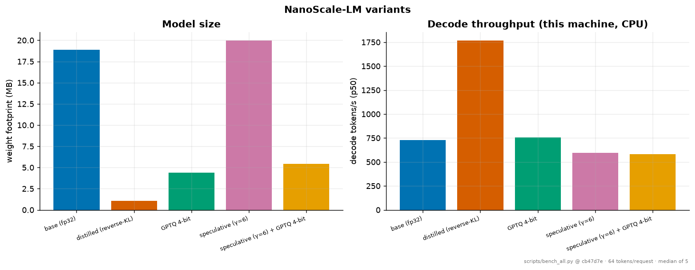

# Results table

Generated by `scripts/bench_all.py` at git `cb47d7e` on `mps:apple-silicon | macOS-15.6-arm64-arm-64bit`. Prompt: `It was a sunny day. Lily went to the park with`, 64 tokens per request, median of 5 measured iterations after 2 warmup iterations.

| variant | params | weights | KV @ ctx | prefill p50 | decode tok/s | latency p50 | latency p95 | val ppl | accept |
|---|---|---|---|---|---|---|---|---|---|
| base (fp32) | 4,952,064 | 18.89 MB | 0.47 MB | 3.5 ms | 729.2 | 91.3 ms | 103.4 ms | 1.4764 | — |
| distilled (reverse-KL) | 279,168 | 1.06 MB | 0.06 MB | 0.8 ms | 1765.8 | 21.6 ms | 37.0 ms | 2.5222 | — |
| GPTQ 4-bit | 4,952,064 | 4.38 MB | 0.47 MB | 3.0 ms | 756.0 | 87.8 ms | 91.2 ms | 1.4766 | — |
| speculative (γ=6) | 5,231,232 | 19.96 MB | 0.53 MB | 0.0 ms | 597.3 | 107.2 ms | 118.0 ms | 1.4764 | 0.475 |
| speculative (γ=6) + GPTQ 4-bit | 5,231,232 | 5.44 MB | 0.53 MB | 0.0 ms | 583.5 | 109.7 ms | 116.5 ms | 1.4766 | 0.475 |

### Tiny-benchmark accuracy

| variant | accuracy | n | chance |
|---|---|---|---|
| base | 100.0% ± 0.0% | 28 | 50% |
| distilled | 67.9% ± 8.8% | 28 | 50% |
| gptq4 | 100.0% ± 0.0% | 28 | 50% |

## How to read this table

**The weight column is the representation size, not the tensor size.** The 4-bit rows are simulated in fp32 because there is no int4 CPU kernel, so reading the footprint off the tensors would report a 4-bit model as 32-bit. The figure is computed from the effective bit-width including the stored scales.

**Speculative rows include the draft's weights and cache in their footprint.** Speculation is not free in memory: it trades space for target forward passes. Reporting only the target's size would hide the trade.

**Decode throughput here is a CPU measurement at 5M parameters and does not generalise.** Speculation reduces target forward passes — that part is real and hardware-independent, and is measured in `results/speculative/` — but at this scale a forward pass is dominated by Python dispatch rather than by weight loading, so the wall-clock win the method exists for does not appear. Quantization likewise shows no speedup because the arithmetic is still fp32.

**The tiny benchmark is saturated** at 100% for the base model. It is a degradation detector for Arc 2, not a quality ladder; an unchanged score means compression did not break the capabilities it probes, and nothing stronger.

Reproduce with: `python scripts/bench_all.py` (or `--replay` to re-render).
