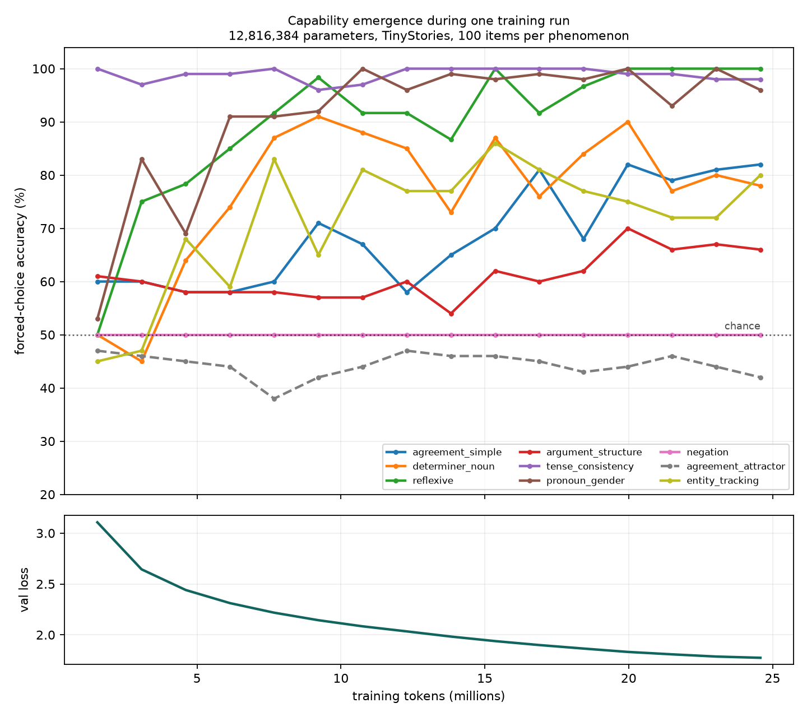

# Capability emergence during training

Generated by `scripts/emergence.py` at git `9a9d3cf` on `mps:apple-silicon | macOS-15.6-arm64-arm-64bit`.

One training run of a 12,816,384-parameter model on TinyStories, with the full minimal-pair suite evaluated every 250 steps (1.54M tokens). Chance is 50%.

| phenomenon | 1st probe | final | reaches 60% | max drop | Spearman ρ vs tokens | p |
|---|---|---|---|---|---|---|
| agreement_simple | 60% | **82%** | 13.8M | 13 pts | +0.82 | 0.0001 |
| determiner_noun | 50% | **78%** | 4.6M | 18 pts | +0.37 | 0.1627 |
| reflexive | 50% | **100%** | 3.1M | 12 pts | +0.87 | 0.0000 |
| argument_structure | 61% | **66%** | 15.4M | 7 pts | +0.64 | 0.0081 |
| tense_consistency | 100% | **98%** | 1.5M | 4 pts | -0.02 | 0.9546 |
| pronoun_gender | 53% | **96%** | 3.1M | 14 pts | +0.71 | 0.0019 |
| negation | 50% | **50%** | never | 0 pts | +0.00 | 1.0000 |
| agreement_attractor | 47% | **42%** | never | 9 pts | -0.25 | 0.3448 |
| entity_tracking | 45% | **80%** | 7.7M | 18 pts | +0.45 | 0.0799 |

Validation loss over the same run: 3.106 → 1.774.

## Why this is worth plotting

A single end-of-training number cannot distinguish *never learned* from *learned and then unlearned*, and the two have opposite implications. A capability that rises and then falls means the model found a shortcut that pays on the training distribution and costs accuracy on the probe, which is a statement about the data, not about capacity. A capability that never moves is a statement about capacity or about the probe.

**Read the Spearman column, not the individual dips.** With 100 items per probe the binomial standard error is about 5 points, so any single point moving by 9 points is barely one standard error of a difference and cannot carry a claim. The rank correlation between accuracy and training tokens uses all 16 probes at once and is the statistic that can.

The ordering itself is the other result: phenomena learnable from local co-occurrence should saturate early and cheaply, while anything requiring structure over a distance should lag. Reading the crossing points down the table gives that ordering directly.

Reproduce with: `python scripts/emergence.py --replay`
