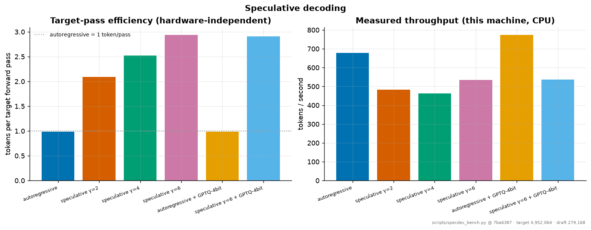

# Speculative decoding

Generated by `scripts/specdec_bench.py` at git `7ba6387` on `mps:apple-silicon | macOS-15.6-arm64-arm-64bit`. Target: 4,952,064 parameters; draft: 279,168 (runs/nano/distill/reverse_kl/final.pt). 8 requests × 64 tokens at temperature 1.0.

| arm | target passes | tokens/pass | acceptance | tokens/s | vs baseline |
|---|---|---|---|---|---|
| autoregressive | 520 | 0.98 | — | 677.4 | 1.00x |
| speculative γ=2 | 245 | 2.09 | 0.590 | 483.2 | 0.71x |
| speculative γ=4 | 203 | 2.52 | 0.424 | 463.2 | 0.68x |
| speculative γ=6 | 174 | 2.94 | 0.367 | 535.5 | 0.79x |
| autoregressive + GPTQ-4bit | 520 | 0.98 | — | 774.8 | 1.14x |
| speculative γ=6 + GPTQ-4bit | 176 | 2.91 | 0.362 | 535.8 | 0.79x |

## Reading the two columns

**Tokens per target forward pass** is the hardware-independent result and the quantity the method actually controls. Autoregressive decoding is 1.0 by definition; speculation raises it toward `γ+1`.

**Tokens per second is a measurement of this machine**, and at `nano` scale on a CPU it can go the *wrong way*. Speculation trades target passes for draft passes, and it only pays when a target pass is expensive relative to a draft pass. On a 5M-parameter model whose forward pass is a handful of small matmuls, Python and dispatch overhead dominate and the draft's `γ` sequential steps can cost more than the target passes they save. The mechanism is real and the target-pass reduction is real; the wall-clock win needs a model where weight loading, not interpreter overhead, is the bottleneck — which is exactly the regime the method was designed for and not the regime a laptop CPU running a 5M-parameter model is in. Reporting the speedup here without that caveat would be misleading.

## Composition with quantization

The last two rows quantize the target to 4-bit GPTQ and then speculate over it. The levers compose because they act on different costs: quantization shrinks the bytes per target pass, speculation reduces the number of target passes. `tests/unit/test_specdec.py::test_speculation_composes_with_a_quantized_target` asserts that greedy speculation over the quantized target reproduces the quantized target's own greedy output token-for-token.

A precise statement of what stays lossless: speculative decoding is lossless **relative to the target it is given**. Quantizing changes the target's distribution; speculation then reproduces *that* distribution exactly. It does not undo the quantization error, and nothing here claims it does.

## Caveats

The draft here is `runs/nano/distill/reverse_kl/final.pt`. Draft quality is the single lever that determines the acceptance rate, and therefore the speedup: an untrained draft agrees with the target only by chance and gives a floor. EAGLE-2/EAGLE-3, which draft on the target's own hidden features rather than with a separate model, are the current state of the art and the documented next step.

One arm deserves a footnote: `autoregressive + GPTQ-4bit` is *faster* than unquantized autoregressive here even though the quantized weights are simulated in fp32 and no int4 kernel is involved. That is measurement noise on a shared laptop, not a quantization speedup — there is no mechanism by which it could be one, and the honest reading is that differences of this size in the tokens/s column should not be interpreted at all.

Reproduce with: `python scripts/specdec_bench.py runs/nano/pretrain/final.pt`
